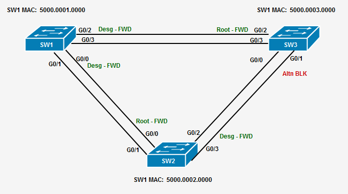
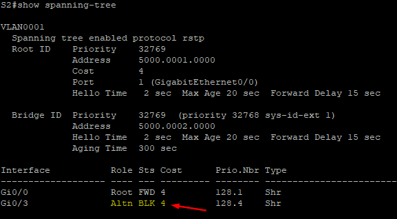

# Лабораторная работа. Развертывание коммутируемой сети с резервными каналами

### Топология


### Таблица Адресации


## Цели

- [Часть 1. Создание сети и настройка основных параметров устройства](#part1)
- [Часть 2. Выбор корневого моста](#part2)
- [Часть 3. Наблюдение за процессом выбора протоколом STP порта, исходя из стоимости портов](#part3)
- [Часть 4. Наблюдение за процессом выбора протоколом STP порта, исходя из приоритета портов](#part4)

**Отказоустойчивость (Redundancy)** - повышает доступность устройств в сетевых топологиях, защищая сеть от **единой точки отказа (single point of failure)**. Отказоустойчивость в коммутируемой сети достигается за счет использования нескольких коммутаторов или нескольких соединений между коммутаторами. При добалении дополнительных линков между коммутаторами могут возникнуть **петли** (loop)и **дублирующиеся кадры**.

Протокол **Spanning Tree (STP)** был разработан как механизм избежания петель (loop) на втором уровне для резервных соединений в коммутируемой сети. **STP** обеспечивает наличие только одного логического пути между всеми пунктами назначения в сети, намеренно блокируя резервные пути, которые могут вызвать петлю.

В этой лабораторной работе мы будем использовать команду `show spanning-tree`, чтобы наблюдать процесс выбора **корневого моста (root bridge)** в STP.Мы также увидим процесс выбора порта на основе стоимости (cost) и приоритета (priority).

**Примечание**: Используются коммутаторы **Cisco vIOS** на платформе **EVE-NG**


<a name="part1"><h2>Часть 1. Создание сети и настройка основных параметров устройства</h2></a>

### **Шаг 1:	Создайте сеть согласно топологии.**

На данном этопе мы подключаем все коммутаторы между собой по паре соединений. 

### **Шаг 2:	Выполните инициализацию и перезагрузку коммутаторов.**

### **Шаг 3:	Настройте базовые параметры каждого коммутатора.**
+   
    + a. Отключите поиск DNS.

        `no ip domain-lookup`

    + b. Присвойте имена устройствам в соответствии с топологией.

        ```
        hostname SW1

        присвойте имена остальным свичам соотвественно (S2,S3)
        ```
        
    + c. Назначьте class в качестве зашифрованного пароля доступа к привилегированному режиму.

        ```
        enable secret level 15 class
        ```

    + d. Назначьте cisco в качестве паролей консоли и VTY и активируйте вход для консоли и VTY каналов.

        ```
        line vty 0 15
        password cisco
        login
        ```

    + e. Настройте logging synchronous для консольного канала.

        ```
        line con 0
        password cisco
        login
        logging synchronous
        ```

    + f. Настройте баннерное сообщение дня (MOTD) для предупреждения пользователей о запрете несанкционированного доступа.

        

    + g. Задайте IP-адрес, указанный в таблице адресации для VLAN 1 на всех коммутаторах.

        ```
        S1

        interface vlan 1
        ip address 192.168.1.1 255.255.255.0

        S2

        interface vlan 1
        ip address 192.168.1.2 255.255.255.0

        S3

        interface vlan 1
        ip address 192.168.1.3 255.255.255.0

        ```

    + h. Сохраните конфигурации на всех коммутаторах.

        ```
        copy running-config startup-config

        ```

### **Шаг 4:	Проверим соединение между всеми коммутаторами посредством пинга.**

```        
Пинг между S1 и S2? - OK
        
Пинг между S1 и S3? - OK

Пинг между S2 и S3? - OK
```

<a name="part2"><h2>Часть 2. Выбор корневого моста (Root Bridge)</h2></a>

Любая сеть, в которой развернут протокол spanning-tree (коммутируемая локальная сеть или широковещательный домен) имеет коммутатор, назначенный в качестве корневого моста. Корневой мост служит точкой отсчета для всех расчетов протокола spanning-tree, чтобы определить, какие порты на коммутаторе нужно блокировать.

Процесс выборов определяет, какой коммутатор станет корневым мостом (Root Bridge). Коммутатор с наименьшим идентификатором моста (BID) становится корневым мостом. BID состоит из значения приоритета моста, расширенного системного идентификатора и MAC-адреса коммутатора (см. картинку ниже). Значение приоритета может варьироваться от 0 до 65,535 с шагом 4,096, при этом значение по умолчанию равно 32,768.


### **Шаг 1: Деактивируйте все порты на коммутаторах.**

```
S1(config)#interface range g0/0-3,g1/0-3
S1(config-if-range)#shutdown
```
Сделайте то же самое для S2 и S3

### **Шаг 2: Настройте подключенные порты как транковые.**

```
S1(config)#interface range g0/0-3

На некоторых более старых моделях коммутаторов необходим сначала ввести эту комманду, прежде чем смочь настроить линк между коммутаторами как транк.

S1(config-if-range)#switchport trunk encapsulation dot1q
S1(config-if-range)#switchport mode trunk


```
### **Шаг 3: Активируйте порты некоторые порты на всех коммутаторах. В нашем случае это следующие порты:**

```
S1(config)#interface range g0/0,g0/2
S1(config-if-range)#no shutdown

S2(config)#interface range g0/0,g0/3
S2(config-if-range)#no shutdown

S3(config)#interface range g0/1,g0/2
S3(config-if-range)#no shutdown
```

### **Шаг 4: Отобразите информацию о spanning-tree.**

Выполните команду **show spanning-tree** на всех трех коммутаторах. Приоритет идентификатора моста (**Bridge ID Priority**) рассчитывается путем сложения значения приоритета (**32768**) и расширенного системного идентификатора (**1**). Расширенный системный идентификатор всегда равен номеру VLAN. В приведенном ниже примере все три коммутатора имеют одинаковые значения приоритета идентификатора моста (32769 = 32768 + 1, где приоритет по умолчанию = 32768, номер VLAN = 1); следовательно, коммутатор с наименьшим MAC-адресом становится корневым мостом. (S1 в нашем примере)


На картинке ниже можно увидеть какие порты открыты, а какие были заблокированы в результате расчета **STP**



Теперь мы можем ответить на следующие вопросы:

1. Какой коммутатор является корневым мостом?

```
Корневым коммутатором является **SW1**
```

2. Почему протокол **spanning-tree** выбрал этот коммутатор в качестве корневого моста?

```
Так как MAC адрес у SW1 по его числовому значению имеет наименьшее значение по сравнению с SW2 и SW3
```

3. Какие порты являются корневыми на коммутаторах?

```
SW2 - G0/0
SW3 - G0/2
```

4. Какие порты являются назначенными (Designated port) на коммутаторах?

```
SW1 - G0/2
      G0/0

SW2 - G0/3
```

5. Какой порт отображается как альтернативный и в данный момент блокируется?

```
SW3 - G0/1
```

<a name="part3"><h2>Часть 3. Наблюдение за процессом выбора протоколом STP порта, исходя из стоимости портов</h2></a>

Алгоритм **spanning tree (STA)** использует корневой мост в качестве точки отсчета, а затем определяет, какие порты нужно блокировать, основываясь на стоимости пути. Предпочтение отдается порту с меньшей стоимостью пути. Если стоимости портов равны, протокол **spanning tree** сравнивает **BID**. Если **BID** также равны, для разрешения конфликта используются приоритеты портов. Предпочтение всегда отдается меньшим значениям. В **части 3** мы изменим стоимость порта, чтобы контролировать, какой порт будет заблокирован протоколом **spanning tree**.

### Шаг 1: Найдем коммутатор с заблокированным портом.

С текущей конфигурацией только один коммутатор должен иметь порт, заблокированный протоколом STP. Выполним команду **show spanning-tree** на обоих некорневых коммутаторах. В приведенном ниже примере протокол **spanning tree** блокирует порт G0/1 на коммутаторе с самым высоким **BID (SW3)**.


### Шаг 2: Изменим стоимость порта.

Помимо заблокированного порта **G0/1**, единственным другим активным портом на этом коммутаторе является порт, назначенный как корневой **G0/2**. Уменьшим стоимость этого корневого порта до **3**, выполнив команду **spanning-tree cost 3** в режиме настройки интерфейса.

```
S3(config)#int g0/2
S3(config-if)#spanning-tree cost 3
```
### Шаг 3: Наблюдайте за изменениями протокола **spanning tree**.

Теперь посмотрим на STP на коммутаторе SW3.




Почему протокол **spanning tree** изменил ранее заблокированный порт на назначенный порт и заблокировал порт, который был назначенным портом на другом коммутаторе?

```
Так как поменялась стоимость порта, то соединение идущее на этот порт также стало более приоритетным с точки зрения STP. 
```
### Шаг 4: Удалите изменения стоимости порта.

1. Выполните команду no spanning-tree cost 18 в режиме настройки интерфейса, чтобы удалить установленное ранее значение стоимости порта.

```
S3(config)#int g0/2
S3(config-if)#no spanning-tree cost 3
```
2. Выполним команду show spanning-tree заново, чтобы убедиться, что протокол STP вернул порты на некорневых коммутаторах к исходным настройкам. Протоколу STP требуется примерно 30 секунд для завершения процесса перехода портов.


<a name="part4"><h2>Часть 4. Понаблюдаем за процессом выбора протоколом STP порта, исходя из приоритета портов</h2></a>

Если стоимости портов равны, протокол spanning tree сравнивает BID. Если BID также равны, то для разрешения конфликта используются приоритеты портов. Значение приоритета порта по умолчанию — 128. Протокол STP объединяет приоритет порта с его номером для разрешения конфликтов. Предпочтение всегда отдается меньшим значениям. В части 4 мы активируем резервные пути к каждому коммутатору, чтобы наблюдать, как протокол STP выбирает порт, используя приоритет порта.

1. Активируем остальные порты на всех коммутаторах

```
S1 - G0/3
     G0/1

S2 - G0/1
     G0/2

S3 - G0/0
     G0/3
```

2. Подождите 30 секунд, пока протокол STP завершит процесс перехода портов, затем выполните команду show spanning-tree на некорневых коммутаторах. Обратите внимание, что корневой порт переместился на порт с меньшим номером, подключенный к корневому коммутатору, а предыдущий корневой порт был заблокирован.


На этой топологии можно увидеть окончательное состояние STP, включая состояние и роль всех портов.


## Какой порт протокол STP выбрал в качестве корневого порта на каждом некорневом коммутаторе?

```
SW2 - G0/0
SW3 - G0/2
```

## Почему протокол STP выбрал эти порты в качестве корневого порта на этих коммутаторах?

Чтобы выбрать корневой порт на некорневых коммутаторах, существуют три основных шага:

1. **Наименьшая** накопленная **стоимость** на интерфейсах в сторону корневого моста.
2. **Наименьший** идентификатор отправляющего моста **(Bridge ID)**.
3. **Наименьший** идентификатор порта отправителя **(Port ID)** (сначала сравнивается приоритет порта, затем номер порта).

На **SW2** корневым портом является **G0/0**, так как у этого порта наименьший идентификатор порта отправителя по сравнению с портом **G0/1**, который также подключен к корневому мосту.

На **SW3** корневым портом является **G0/2**, так как у этого порта также наименьший идентификатор порта отправителя по сравнению с портом **G0/3**, который также подключен к корневому мосту.