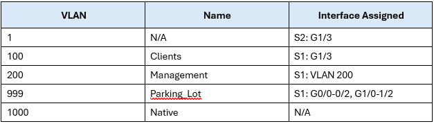

# Lab - Implement DHCPv4

### Topology

### Addressing Table

### Vlan Table

# Цели

+ **Часть 1: Построение сети и настройка базовых параметров устройств**
+ **Часть 2: Настройка и проверка двух DHCPv4-серверов на R1**
+ **Часть 3: Настройка и проверка DHCP Relay на R2**

### **Предыстория / Сценарий**

Протокол динамической конфигурации хостов **(DHCP)** — это сетевой протокол, который позволяет сетевым администраторам управлять и автоматизировать назначение IP-адресов. Без **DHCP** для **IPv4** администратору приходится вручную назначать и настраивать IP-адреса, предпочтительные DNS-серверы и шлюзы по умолчанию. По мере роста сети это становится административной проблемой, особенно когда устройства перемещаются из одной внутренней сети в другую.

В данном сценарии компания увеличила свои масштабы, и сетевые администраторы больше не могут вручную назначать IP-адреса устройствам. **Наша задача** — настроить маршрутизатор **R1** для назначения IPv4-адресов в двух разных подсетях.

### Необходимые ресурсы

Я сделал эту лабораторную работу в EVE-NG, и в ней я использовал следующие устройства:

+ 2x Cisco vIOS Router
+ 2x Cisco vIOS Switch
+ 2x Virtual PC (VPCS)

### Instruction
