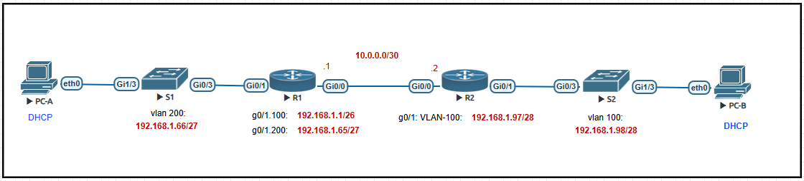

# Lab - Implement DHCPv4

### Topology



### Addressing Table


### Vlan Table


# Цели

+ **Часть 1: Построение сети и настройка базовых параметров устройств**
+ **Часть 2: Настройка и проверка двух DHCPv4-серверов на R1**
+ **Часть 3: Настройка и проверка DHCP Relay на R2**

### **Предыстория / Сценарий**

Протокол динамической конфигурации хостов **(DHCP)** — это сетевой протокол, который позволяет сетевым администраторам управлять и автоматизировать назначение IP-адресов. Без **DHCP** для **IPv4** администратору приходится вручную назначать и настраивать IP-адреса, предпочтительные DNS-серверы и шлюзы по умолчанию. По мере роста сети это становится административной проблемой, особенно когда устройства перемещаются из одной внутренней сети в другую.

В данном сценарии компания увеличила свои масштабы, и сетевые администраторы больше не могут вручную назначать IP-адреса устройствам. **Наша задача** — настроить маршрутизатор **R1** для назначения IPv4-адресов в двух разных подсетях.

### Необходимые ресурсы

Я сделал эту лабораторную работу в EVE-NG, и в ней я использовал следующие устройства:

+ 2x Cisco vIOS Router
+ 2x Cisco vIOS Switch
+ 2x Virtual PC (VPCS)

## Instruction

## - **Часть 1: Построение сети и настройка базовых параметров устройств**

В **части 1** мы создадим топологию сети и настроим базовые параметры на хостах **PC-A**, **PC-B** и коммутаторах.

**Шаг 1**: Установим схему адресации

Разделим сеть **192.168.1.0/24** на подсети, чтобы удовлетворить следующие требования:

**a.** Одна подсеть, **«Подсеть A»**, поддерживающая **58 хостов** (клиентский VLAN на R1).

**Подсеть A:**
```
192.168.1.0/26 (.1 - 63)
```
Запишим первый IP-адрес в таблице адресации для R1 G0/1.100. Запишим второй IP-адрес в таблице адресации для S1 VLAN 200 и укажем соответствующий шлюз по умолчанию.

**b.** Одна подсеть, **«Подсеть B»**, поддерживающая **28 хостов** (Management VLAN на R1).

**Подсеть B:**
```
192.168.1.64/27 (.65-.95)
```
Запишим первый IP-адрес в таблице адресации для **R1 G0/1.200**. Запишим второй IP-адрес в таблице адресации для **S1 VLAN 1** и укажем соответствующий шлюз по умолчанию.

**c.** Одна подсеть, **«Подсеть C»**, поддерживающая **12 хостов** (клиентская сеть на **R2**).

**Подсеть C:**
```
192.168.1.96/28 (.97-.111)
```
Запишим первый IP-адрес в таблице адресации для **R2 G0/1**.