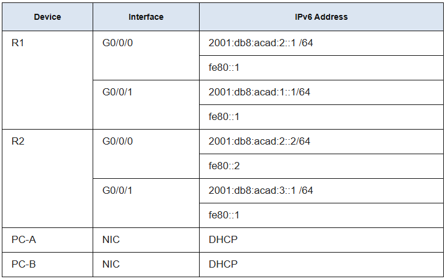
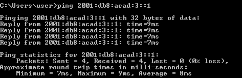
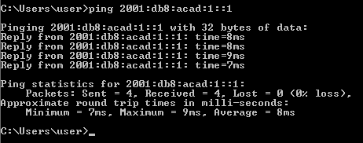

# Лабораторная работа – Настройка DHCPv6

## Содержание
- [Топология](#item_01)
- [Таблица адресации](#item_02)
- [Цели](#item_03)
- [Контекст / Сценарий](#item_04)
- [Часть 1: Построить сеть и настроить базовые параметры устройств](#part_1)
- [Часть 2: Проверить назначение адреса SLAAC с устройства R1](#part_2)
- [Часть 3: Настроить и проверить сервер Stateless DHCPv6 на устройстве R1](#part_3)
- [Часть 4: Настроить и проверить сервер Stateful DHCPv6 на устройстве R1](#part_4)
- [Часть 5: Настроить и проверить DHCPv6 Relay на устройстве R2](#part_5)
- [Часть 6](#item_6)

<a name="item_01"><h2>Топология</h2></a>

<a name="item_02"><h2>Таблица адресации</h2></a>



<a name="item_03"><h2>Цели</h2></a>

### Цели
- [Часть 1: Построить сеть и настроить базовые параметры устройств](#part_1)
- [Часть 2: Проверить назначение адреса SLAAC с устройства R1](#part_2)
- [Часть 3: Настроить и проверить сервер Stateless DHCPv6 на устройстве R1](#part_3)
- [Часть 4: Настроить и проверить сервер Stateful DHCPv6 на устройстве R1](#part_4)
- [Часть 5: Настроить и проверить DHCPv6 Relay на устройстве R2](#part_5)

<a name="item_04"><h2>Контекст / Сценарий</h2></a>

Динамическое назначение глобальных адресов IPv6 (GUA) можно настроить тремя способами:

- Stateless Address Autoconfiguration (SLAAC)
- Stateless Dynamic Host Configuration Protocol для IPv6 (DHCPv6)
- Stateful DHCPv6

При использовании SLAAC для назначения IPv6-адресов хостам сервер DHCPv6 не используется. Поскольку сервер DHCPv6 не используется при реализации SLAAC, хосты не могут получать дополнительную важную сетевую информацию, включая адрес сервера доменных имен (DNS) и доменное имя.

При использовании Stateless DHCPv6 для назначения IPv6-адресов хостам сервер DHCPv6 используется для назначения дополнительной важной сетевой информации, однако IPv6-адрес назначается с использованием SLAAC.

При реализации Stateful DHCPv6 сервер DHCPv6 назначает всю сетевую информацию, включая IPv6-адрес.

Решение о том, как хосты получают динамические IPv6-адреса, зависит от настроек флагов, содержащихся в сообщениях объявления маршрутизатора (RA).

В данном сценарии компания расширилась, и сетевые администраторы больше не могут вручную назначать IP-адреса устройствам. Ваша задача — настроить маршрутизатор R2 для назначения IPv6-адресов на двух различных подсетях, подключенных к маршрутизатору R1.

### Необходимые ресурсы

Так как эта лабораторная работа была сделана на платформе EVE-NG, мы используев следующие устройства:

- 2х Cisco vIOS Routers
- 2x Cisco vIOS Switches
- 2x Virtual PC's (VPCS)

## Инструкции

<a name="part_1"><h2>Часть 1: Построить сеть и настроить базовые параметры устройств</h2></a>

В **Части 1** мы настроим топологию сети и базовые настройки на хостах **ПК** и **коммутаторах**.

#### **Шаг 1:** Подключите устройства в сеть, как показано на топологической схеме.

Подключите устройства, как показано на диаграмме топологии, и подключите кабели при необходимости.

#### **Шаг 2:** Настройте базовые параметры для каждого коммутатора. (Необязательно)

**a.** Назначьте имя устройству-коммутатору.
```
switch(config)# hostname S1
switch(config)# hostname S2
```

**b.** Отключите поиск **DNS**, чтобы предотвратить попытки маршрутизатора переводить неверно введенные команды, как если бы это были имена хостов.
```
S1(config)# no ip domain-lookup
S2(config)# no ip domain-lookup
```

**c.** Назначьте пароль "**class**" для привилегированного **EXEC** в зашифрованном виде.
```
S1(config)# enable secret class
S2(config)# enable secret class
```
**d.** Назначьте пароль **"cisco"** для консоли и включите вход.
```
S1(config)# line console 0
S1(config-line)# password cisco
S1(config-line)# login

S2(config)# line console 0
S2(config-line)# password cisco
S2(config-line)# login
```

**e.** Назначьте пароль **"cisco"** для **VTY** и включите вход.
```
S1(config)# line vty 0 4
S1(config-line)# password cisco
S1(config-line)# login

S2(config)# line vty 0 4
S2(config-line)# password cisco
S2(config-line)# login
```

**f.** Зашифруйте пароли в открытом виде.
```
S1(config)# service password-encryption

S2(config)# service password-encryption
```

**g.** Создайте баннер, который предупреждает всех, кто пытается получить доступ к устройству, что несанкционированный доступ запрещен.
```
S1(config)# banner motd $ Authorized Users Only! $

S2(config)# banner motd $ Authorized Users Only! $
```

**h.** Отключите все неиспользуемые порты.
```
S1(config)# interface range g0/0-2,g1/0-2
S1(config-if-range)# shutdown

S2(config)# interface range g0/0-2,g1/0-2
S2(config-if-range)# shutdown
```

**i.** Сохраните текущую конфигурацию в файл стартовой конфигурации.
```
S1# copy running-config startup-config

S2# copy running-config startup-config
```

#### **Шаг 3:** Настройте базовые параметры для каждого маршрутизатора.

**a.** Назначьте имя устройству маршрутизатору.
```
router(config)# hostname R1

router(config)# hostname R2
```

**b.** Отключите поиск DNS, чтобы предотвратить попытки маршрутизатора переводить неверно введенные команды, как если бы это были имена хостов.
```
R1(config)# no ip domain-lookup

R2(config)# no ip domain-lookup
```
**c.** Назначьте пароль "class" для привилегированного EXEC в зашифрованном виде.
```
R1(config)# enable secret class
R2(config)# enable secret class
```
**d.** Назначьте пароль "cisco" для консоли и включите вход.
```
R1(config)# line console 0
R1(config-line)# password cisco
R1(config-line)# login

R2(config)# line console 0
R2(config-line)# password cisco
R2(config-line)# login
```
**e.** Назначьте пароль "cisco" для VTY и включите вход.
```
R1(config)# line vty 0 4
R1(config-line)# password cisco
R1(config-line)# login

R2(config)# line vty 0 4
R2(config-line)# password cisco
R2(config-line)# login
```
**f.** Зашифруйте пароли в открытом виде.
```
R1(config)# service password-encryption

R2(config)# service password-encryption
```
**g.** Создайте баннер, который предупреждает всех, кто пытается получить доступ к устройству, что несанкционированный доступ запрещен.
```
R1(config)# banner motd $ Authorized Users Only! $

R2(config)# banner motd $ Authorized Users Only! $
```

**h.** Включите маршрутизацию IPv6.
```
R1(config)# ipv6 unicast-routing

R2(config)# ipv6 unicast-routing
```

**i.** Сохраните текущую конфигурацию в файл стартовой конфигурации.
```
R1(config)# exit
R1# copy running-config startup-config

R2(config)# exit
R2# copy running-config startup-config
```

#### **Шаг 4:** Настройте интерфейсы и маршрутизацию для обоих маршрутизаторов.

**a.** Настройте интерфейсы G0/0 и G0/1 на R1 и R2 с указанными в таблице выше IPv6-адресами.
```
R1(config)# interface g0/1
R1(config-if)# ipv6 address fe80::1 link-local
R1(config-if)# ipv6 address 2001:db8:acad:1::1/64
R1(config-if)# no shutdown
R1(config)# interface g0/0
R1(config-if)# ipv6 address fe80::1 link-local
R1(config-if)# ipv6 address 2001:db8:acad:2::1/64
R1(config-if)# no shutdown

R2(config)# interface g0/1
R2(config-if)# ipv6 address fe80::1 link-local
R2(config-if)# ipv6 address 2001:db8:acad:3::1/64
R2(config-if)# no shutdown
R2(config)# interface g0/0
R2(config-if)# ipv6 address fe80::2 link-local
R2(config-if)# ipv6 address 2001:db8:acad:2::2/64
R2(config-if)# no shutdown
```
**b.** Настройте маршрут по умолчанию на каждом маршрутизаторе, указывающий на IP-адрес G0/0 
другого маршрутизатора.
```
R1(config)# ipv6 route ::/0 2001:db8:acad:2::2
R2(config)# ipv6 route ::/0 2001:db8:acad:2::1
```
**c.** Проверьте работу маршрутизации, пропингуйте адрес G0/1 на R2 с маршрутизатора R1.
```
R1#ping 2001:db8:acad:3::1
Type escape sequence to abort.
Sending 5, 100-byte ICMP Echos to 2001:DB8:ACAD:3::1, timeout is 2 seconds:
!!!!!
Success rate is 100 percent (5/5), round-trip min/avg/max = 3/3/5 ms
R1#

```
**d.** Сохраните текущую конфигурацию в файл стартовой конфигурации.
```
R1# copy running-config startup-config
```

<a name="part_2"><h2>Часть 2: Проверить назначение адреса SLAAC с устройства R1</h2></a>

В **Части 2** вы проверите что хост **PC-A** получил **IPv6-адрес** с использованием метода SLAAC.

Включите **PC-A** и убедитесь, что его сетевая карта настроена для автоматической конфигурации **IPv6**.

Через некоторое время результат выполнения команды **show ipv6** (только в **EVE-NG**) должен показать, что PC-A присвоил себе адрес из сети 2001:db8:acad:1::/64.
```
C:\Users\Student> ipconfig
Windows IP Configuration

Ethernet adapter Ethernet 2:

   Connection-specific DNS Suffix  . : 
   IPv6 Address. . . . . . . . . . . : 2001:db8:acad:1:5c43:ee7c:2959:da68
   Temporary IPv6 Address. . . . . . : 2001:db8:acad:1:3c64:e4f9:46e1:1f23
   Link-local IPv6 Address . . . . . : fe80::5c43:ee7c:2959:da68%6
   IPv4 Address. . . . . . . . . . . : 169.254.218.104
   Subnet Mask . . . . . . . . . . . : 255.255.0.0
   Default Gateway . . . . . . . . . : fe80::1%6
```
**Откуда взялась часть адреса host-id?**
```

Ответ будет зависеть от конфигурации операционной системы. Либо хост генерирует адрес EUI-64 на основе MAC-адреса интерфейса, либо хост генерирует случайный 64-битный адрес.
```

<a name="part_3"><h2>Часть 3: Настроить и проверить сервер Stateless DHCPv6 на устройстве R1</h2></a>

В Части 3 мы настроим и проверим статeless сервер DHCP на R1. Цель — предоставить ПК-A информацию о сервере DNS и домене.

#### **Шаг 1:** Изучим конфигурацию ПК-A более подробно.

**a.** Выполните команду ipconfig /all на PC-A и посмотрите на вывод.
```
C:\Users\Student> ipconfig /all
Windows IP Configuration

   Host Name . . . . . . . . . . . . : PC-A
   Primary Dns Suffix  . . . . . . . : 
   Node Type . . . . . . . . . . . . : Hybrid
   IP Routing Enabled. . . . . . . . : No
   WINS Proxy Enabled. . . . . . . . : No

Ethernet adapter Ethernet0:

   Connection-specific DNS Suffix  . : 
   Description . . . . . . . . . . . : Intel(R) 852574L Gigabit Network Connection
   Physical Address. . . . . . . . . : 50-00-00-1D-00-00
   IPv6 Address. . . . . . . . . . . : 2001:db8:acad:1:5c43:ee7c:2959:da68(Preferred)
   Temporary IPv6 Address. . . . . . : 2001:db8:acad:1:3c64:e4f9:46e1:1f23(Preferred)
   Link-local IPv6 Address . . . . . : fe80::5c43:ee7c:2959:da68%6(Preferred)
   IPv4 Address. . . . . . . . . . . : 169.254.218.104(Preferred)
   Subnet Mask . . . . . . . . . . . : 255.255.0.0
   Default Gateway . . . . . . . . . : fe80::1%6
   DHCPv6 IAID . . . . . . . . . . . : 50334761
   DHCPv6 Client DUID. . . . . . . . : 00-01-00-01-24-F5-CE-A2-00-50-56-B3-63-6D
   DNS Servers . . . . . . . . . . . : fec0:0:0:ffff::1%1
                                       fec0:0:0:ffff::2%1
                                       fec0:0:0:ffff::3%1
   NetBIOS over Tcpip. . . . . . . . : Enabled
```
b. Обратите внимание, что отсутствует основной суффикс DNS. Также обратите внимание, что адреса серверов DNS указаны как "site local anycast" адреса, а не как адреса unicast, как ожидалось.

#### **Шаг 2:** Настройка R1 для предоставления stateless DHCPv6 для PC-A.

**a.** Создайте пул .**DHCPv6.** на .**R1.** с именем .**R1-STATELESS.**. В этом пуле назначьте адрес сервера .**DNS.** как .**2001:db8:acad::1.** и доменное имя как stateless.com.
```
R1(config)# ipv6 dhcp pool R1-STATELESS
R1(config-dhcp)# dns-server 2001:db8:acad::254
R1(config-dhcp)# domain-name STATELESS.com
```
**b.** Настройте интерфейс .**G0/1.** на .**R1.** для предоставления флага .**OTHER.** конфигурации сети .**R1.** и укажите созданный пул .**DHCP.** в качестве ресурса .**DHCP.** для этого интерфейса.
```
R1(config)# interface g0/1
R1(config-if)# ipv6 nd other-config-flag
R1(config-if)# ipv6 dhcp server R1-STATELESS
```
**c.** Сохраните текущую конфигурацию в файл стартовой конфигурации.
```
R1# copy running-config startup-config
```
**d.** Перезагрузите **PC-A.**.

**e.** Изучите вывод команды .**ipconfig /all.** и обратите внимание на изменения.
```
C:\Users\Student> ipconfig /all
Windows IP Configuration

   Host Name . . . . . . . . . . . . : PC-A
   Primary Dns Suffix  . . . . . . . : 
   Node Type . . . . . . . . . . . . : Hybrid
   IP Routing Enabled. . . . . . . . : No
   WINS Proxy Enabled. . . . . . . . : No
   DNS Suffix Search List. . . . . . : STATELESS.com

Ethernet adapter Ethernet0:

   Connection-specific DNS Suffix  . : STATELESS.com
   Description . . . . . . . . . . . : Intel(R) 82574L Gigabit Network Connection
   Physical Address. . . . . . . . . : 50-00-00-1D-00-00
   DHCP Enabled. . . . . . . . . . . : Yes
   Autoconfiguration Enabled . . . . : Yes
   IPv6 Address. . . . . . . . . . . : 2001:db8:acad:1:5c43:ee7c:2959:da68(Preferred)
   Temporary IPv6 Address. . . . . . : 2001:db8:acad:1:3c64:e4f9:46e1:1f23(Preferred)
   Link-local IPv6 Address . . . . . : fe80::5c43:ee7c:2959:da68%6(Preferred)
   IPv4 Address. . . . . . . . . . . : 169.254.218.104(Preferred)
   Subnet Mask . . . . . . . . . . . : 255.255.0.0
   Default Gateway . . . . . . . . . : fe80::1%6
   DHCPv6 IAID . . . . . . . . . . . : 50334761
   DHCPv6 Client DUID. . . . . . . . : 00-01-00-01-24-F5-CE-A2-00-50-56-B3-63-6D
   DNS Servers . . . . . . . . . . . : 2001:db8:acad::254
   NetBIOS over Tcpip. . . . . . . . : Enabled
   Connection-specific DNS Suffix Search List :
                                       STATELESS.com
```
**f.** Проверьте подключение, пропингуйте .**IP-адрес.** интерфейса .**G0/1.** на .**R2.**.



<a name="part_4"><h2>Часть 4: Настроить и проверить сервер Stateful DHCPv6 на устройстве R1</h2></a>


В **Части 4** мы настроим **R1** для ответа на запросы **DHCPv6** с **LAN**, подключенной к **R2**.

**a.** Создайте пул **DHCPv6** на **R1** для сети **2001:db8:acad:3:aaaa::/80**. Этот пул будет предоставлять адреса для **LAN**, подключенной к интерфейсу **G0/1** на **R2**. В рамках пула установите сервер **DNS** как **2001:db8:acad::254** и доменное имя как STATEFUL.com.
```
R1(config)# ipv6 dhcp pool R2-STATEFUL
R1(config-dhcp)# address prefix 2001:db8:acad:3:aaa::/80
R1(config-dhcp)# dns-server 2001:db8:acad::254
R1(config-dhcp)# domain-name STATEFUL.com
```
**b.** Назначьте только что созданный пул **DHCPv6** интерфейсу **G0/0** на **R1**.
```
R1(config)# interface g0/0
R1(config-if)# ipv6 dhcp server R2-STATEFUL
```

<a name="part_5"><h2>Часть 5: Настроить и проверить DHCPv6 Relay на устройстве R2</h2></a>

В **Части 5** вы настроите и проверите **DHCPv6 relay** на R2, чтобы PC-B мог получить **IPv6-адрес**.

#### **Шаг 1:** Включите PC-B и изучите сгенерированный им адрес SLAAC.
```
C:\Users\Student> ipconfig /all
Windows IP Configuration

   Host Name . . . . . . . . . . . . : DESKTOP-3FR7RKA
   Primary Dns Suffix  . . . . . . . : 
   Node Type . . . . . . . . . . . . : Hybrid
   IP Routing Enabled. . . . . . . . : No
   WINS Proxy Enabled. . . . . . . . : No

Ethernet adapter Ethernet0:

   Connection-specific DNS Suffix  . : 
   Description . . . . . . . . . . . : Intel(R) 82574L Gigabit Network Connection
   Physical Address. . . . . . . . . : 50-00-00-2D-00-00
   DHCP Enabled. . . . . . . . . . . : Yes
   Autoconfiguration Enabled . . . . : Yes
   IPv6 Address. . . . . . . . . . . : 2001:db8:acad:3:a0f3:3d39:f9fb:a020(Preferred)
   Temporary IPv6 Address. . . . . . : 2001:db8:acad:3:d4f3:7b16:eeee:b2b5(Preferred)
   Link-local IPv6 Address . . . . . : fe80::a0f3:3d39:f9fb:a020%6(Preferred)
   IPv4 Address. . . . . . . . . . . : 169.254.160.32(Preferred)
   Subnet Mask . . . . . . . . . . . : 255.255.0.0
   Default Gateway . . . . . . . . . : fe80::1%6
   DHCPv6 IAID . . . . . . . . . . . : 50334761
   DHCPv6 Client DUID. . . . . . . . : 00-01-00-01-24-F2-08-38-00-50-56-B3-7B-06
   DNS Servers . . . . . . . . . . . : fec0:0:0:ffff::1%1
                                       fec0:0:0:ffff::2%1
                                       fec0:0:0:ffff::3%1
   NetBIOS over Tcpip. . . . . . . . : Enabled
```
Обратите внимание на вывод, в котором **префикс**, используемый для адреса, — **2001:db8:acad:3::**.


#### **Шаг 2:** Настройка R2 как агента DHCP relay для сети на G0/0/1.

**a.** Настройте команду ipv6 dhcp relay на интерфейсе G0/1 на R2, указав адрес назначения как адрес интерфейса G0/0/0 на R1. Также настройте команду managed-config-flag.
```
R2(config)# interface g0/1
R2(config-if)# ipv6 nd managed-config-flag
R2(config-if)# ipv6 dhcp relay destination 2001:db8:acad:2::1 g0/0
```
**b.** Сохраните вашу конфигурацию.

#### **Шаг 3:** Попытка получения IPv6-адреса от DHCPv6 на ПК-B.

**a.** Перезагрузите PC-B.

**b.** Откройте командную строку на **PC-B** и выполните команду **ipconfig /all**, чтобы изучить вывод и увидеть результаты работы операции **DHCPv6 relay**.
```
C:\Users\Student> ipconfig /all
Windows IP Configuration

   Host Name . . . . . . . . . . . . : DESKTOP-3FR7RKA
   Primary Dns Suffix  . . . . . . . : 
   Node Type . . . . . . . . . . . . : Hybrid
   IP Routing Enabled. . . . . . . . : No
   WINS Proxy Enabled. . . . . . . . : No
   DNS Suffix Search List. . . . . . : STATEFUL.com

Ethernet adapter Ethernet0:

   Connection-specific DNS Suffix  . : STATEFUL.com
   Description . . . . . . . . . . . : Intel(R) 852574L Gigabit Network Connection
   Physical Address. . . . . . . . . : 50-00-00-2D-00-00
   DHCP Enabled. . . . . . . . . . . : Yes
   Autoconfiguration Enabled . . . . : Yes
   IPv6 Address. . . . . . . . . . . : 2001:db8:acad3:aaaa:7104:8b7d:5402(Preferred)
   Lease Obtained. . . . . . . . . . : Sunday, October 6, 2019 3:27:13 PM
   Lease Expires . . . . . . . . . . : Tuesday, October 8, 2019 3:27:13 PM
   Link-local IPv6 Address . . . . . : fe80::a0f3:3d39:f9fb:a020%6(Preferred)
   IPv4 Address. . . . . . . . . . . : 169.254.160.32(Preferred)
   Subnet Mask . . . . . . . . . . . : 255.255.0.0
   Default Gateway . . . . . . . . . : fe80::2%6
   DHCPv6 IAID . . . . . . . . . . . : 50334761
   DHCPv6 Client DUID. . . . . . . . : 00-01-00-01-24-F2-08-38-00-50-56-B3-7B-06
   DNS Servers . . . . . . . . . . . : 2001:db8:acad::254
   NetBIOS over Tcpip. . . . . . . . : Enabled
   Connection-specific DNS Suffix Search List  :
                                       STATEFUL.com

```
**c.** Проверьте подключение, пропингуйте **IP-адрес** интерфейса **G0/1** на **R1**.



