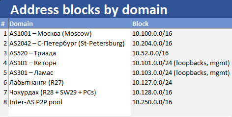
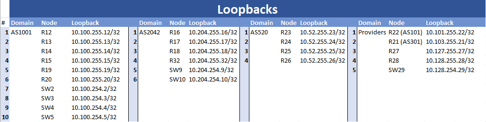

# Лабораторная работа - Архитектура Сети

## Содержание:

- [Топология](#item_01)
- [Конвенции](#item_01.1)
- [Таблицы адресации](#item_02)
- [Цели](#item_03)
- [Часть 1: Разработка и документация адресного пространства для лаборатории.](#part_1)
- [Часть 2: Настроите ip адреса на каждом активном порту](#part_2)
- [Часть 3: Настроите каждый VPC в каждом офисе в своем VLAN.](#part_3)
- [Часть 4: Настроите VLAN/Loopbackup interface управления для сетевых устройств](#part_4)
- [Часть 5: Настройка VRRP на маршрутизаторах R12 и R13, R16 и R17](#part_5)
- [Часть 6: Настройка конфигурации LACP на коммутаторах SW4–SW5 и SW9–SW10](#part_6)


<a name="item_01"><h2>Топология</h2></a>


<a name="item_01.1"><h2>Конвенции</h2></a>

Тут я хотел бы обозначить несколько моментов. Во-первых, необходимо определиться с конвенциями. Ниже я описываю, какие именно конвенции я использую.

### Глобальные правила

**P2P**-линки используют **/31** (RFC 3021).

**Core-to-Distribution** - линки используют **/30** 

**Loopback-адреса** — /32 (ID роутеров).

**Кампусные VLAN** — /24.

Каждому автономному домену **(AS)** выделяется свой **/16**, разделённый на предсказуемые роли:

**…130.0/24** = Все меж-AS соединения

**…120.0/24** = Distribution - Access - линки

**…10.0/24 и …20.0/24** = VLAN 10 и 20 для пользователей

**…254.x/32** = loopback-адреса коммутаторов (необязательно)

**…255.x/32** = loopback-адреса маршрутизаторов


<a name="item_02"><h2>Таблицы Адресации</h2></a>

### Ниже приведены блоки адресов для каждой зоны


###
###

### Loopback адреса для всех устройств. Первые два октета соответствуют зонам, третий актет - для маршрутизаторов = .255, для коммутаторов = .254


###
###

### Inter-AS линки (10.250.130.0/16)


<a name="item_03"><h2>Цели</h2></a>

> ⚠️ **Важно:** Маршрутизация на данном этапе *не выполняется* и будет реализована на следующих стадиях проекта.

# **Целью данной лабораторной работы является**

1. **Разработка адресного пространства**  
   Формирование детализированной и масштабируемой схемы IP-адресации, включающей распределение сетей по зонам, назначение адресов интерфейсам маршрутизаторов, коммутаторов и виртуальных интерфейсов, а также определение служебных сетей для управления и тестирования.

2. **Создание VLAN**  
   Проектирование и внедрение виртуальных локальных сетей, обеспечивающих логическую сегментацию трафика, разделение доменов широковещания и организацию изолированных зон для различных групп устройств.

3. **Настройка LACP**  
   Конфигурация агрегации каналов по протоколу LACP (802.3ad) для увеличения пропускной способности и обеспечения отказоустойчивости соединений между коммутаторами.

4. **Конфигурация VRRP**  
   Реализация механизма резервирования шлюза по протоколу VRRP для обеспечения высокой доступности, автоматического переключения при отказе активного маршрутизатора и балансировки нагрузки между устройствами.

5. **Настройка VPC**  
   Создание виртуальных ПК (VPC), назначение им IP-адресов и шлюзов, интеграция их в соответствующие VLAN, а также подготовка окружения для проверки сетевых функций и протоколов.

6. **Проверка соединения между VPC и маршрутизаторами**  
   Тестирование доступности маршрутизаторов из различных VLAN, проверка правильности маршрутизации, ARP-разрешений, а также корректности работы интерфейсов и шлюзов.

7. **Проверка работы VRRP**  
   Проведение тестов отказоустойчивости: подтверждение правильного выбора master-устройства, наблюдение за переключением VRRP-групп при отключении активного маршрутизатора, анализ восстановления и возврата приоритетов.


<a name="part_1"><h2>Часть 1: Разработка и документация адресного пространства для лаборатории.</h2></a>


### Отчёт о системе адресации в лабораторной сети
## 1. Введение

Цель данного отчёта — описать логику и структуру системы адресации, применённой в лабораторной топологии, включающей:

- маршрутизаторы **R12–R28**
- коммутаторы **SW2–SW29**
- многоподсеточную архитектуру (**10.100.x.x, 10.204.x.x, 10.52.x.x, 10.128.x.x**)
- управляющую сеть **192.168.102.0/24** для всех устройств

Схема адресации выдерживает единые принципы и упрощает маршрутизацию, диагностику и масштабирование сети.

## 2. Общая концепция адресации

Сеть использует четыре основных адресных плана, каждый из которых относится к определённому логическому региону или зоне:

| Зона              | Пример адресов           | Использование                       |
| ----------------- | ------------------------ | ----------------------------------- |
| **10.100.x.x**    | R12, R13, R14, R15, R19, |               Valhalla              |
|                   | R20, SW2, SW3, SW4, SW5  |                                     |
| **10.101.x.x**    | R22                      |               IceLand               |
| **10.103.x.x**    | R21                      |               Frankia               |
| **10.204.x.x**    | R16, R17, R18, SW9, SW10 |               Helheim               |
|                   | R32                      |                                     |
| **10.52.x.x**     | R23, R24, R25, R26       |            Valkeria-Hall            |
| **10.127.x.x**    | R27                      |               Wessex                |
| **10.128.x.x**    | R28                      |               Midgard               |
| **192.168.102.x** | Все устройства           |    Управляющая (management) сеть    |


## 3. Адресация в управляющей сети (Management Network)

Все устройства имеют интерфейс (**e1/3**) в сети:

**192.168.102.0/24**


Каждому устройству присвоен адрес в диапазоне 192.168.102.100–129, где номер устройства соответствует последнему октету адреса.

Примеры:

- **R12 → 192.168.102.112**
- **R13 → 192.168.102.113**
- **R14 → 192.168.102.114**
- **SW9 → 192.168.102.109**
- **SW29 → 192.168.102.129**

Назначение:

- управление оборудованием (SSH, SNMP)
- мониторинг
- изоляция от пользовательских и маршрутизируемых VLAN

Такой подход обеспечивает стабильный доступ администратора вне зависимости от состояния основных маршрутов.

## 4. Адресация Loopback-интерфейсов

Каждый маршрутизатор имеет **loopback**-интерфейс вида:

**10.xxx.255.RR/32**

Каждый коммутатор имеет **loopback**-интерфейс вида:

**10.xxx.254.SS/32**

Где RR — номер маршрутизатора.
    SS - номер коммутатора

Примеры:

- **R12 → 10.100.255.12/32**
- **R13 → 10.100.255.13/32** 
- **R21 → 10.103.255.21/32**
- **R23 → 10.52.255.23/32**

Назначение:

- стабильные идентификаторы для **IGP (OSPF/ISIS)**
- опорные точки для **BGP Router-ID**
- точка для управляющих протоколов (**VRRP, SLA, NetFlow** и т. д.)

**Loopback-адреса** уникальны в масштабе всей топологии и никогда не меняются.

## **5. Адресация пользовательских VLAN**

В сети присутствуют VLAN 10, 20, 102 и др. Адресация построена по принципу:

``10.<region>.<vlan>.<device>``

---
## VLAN 10, 20 присутсвтуют в трез зонах:

```
- Valhalla
- Helheim
- Midgard
```

``Адресация соответсвтует блокам ip адерсов в зоне.``

----

### Valhalla
```
- VLAN 10 (10.100.10.0/24)
- VLAN 20 (10.100.20.0/24)
```


Используется на R12, R13:

- **R12 → 10.100.10.2** (суб интерфейс - e0/0.10)
- **R13 → 10.100.10.3**
- **VRRP виртуальный шлюз → 10.100.10.1**

---

### **VLAN 20 (10.100.20.0/24)**

- **R12 → 10.100.20.2**
- **R13 → 10.100.20.3**
- **VRRP виртуальный шлюз → 10.100.20.1**

---

### **VLAN 102 (Management VLAN)**

На разных коммутаторах имеет вид:

- **SW2 → x.x.102.102**
- **SW3 → x.x.102.103**
- **SW4 → x.x.102.104**
- **SW5 → x.x.102.105**
- **SW9 → x.x.102.109**
- **SW10 → x.x.102.110**
- **SW29 → x.x.102.129**

VLAN 102 сделан для упрощения менеджмента.


<a name="part_2"><h2>Часть 2: Настроите ip адреса на каждом активном порту.</h2></a>

# Отчет по настройке интерфейсов сетевых устройств

На данном этапе задачей является конфигурация сетевых интерфейсов на всех устройствах лабораторного стенда (маршрутизаторы и коммутаторы) с обеспечением корректной адресации, управления и связности между узлами сети.

## Общие принципы конфигурации
При настройке интерфейсов на всех устройствах были использованы следующие принципы:

- Каждый сетевой интерфейс имеет четко определённую роль (транзитный, пользовательский, управляющий).
- Управляющий доступ к устройствам реализован через отдельный L3-интерфейс с IP-адресом из сети управления.
- Неиспользуемые интерфейсы переведены в состояние *shutdown* (в первую очередь на маршрутизаторах).
- Для логической идентификации устройств используются loopback-интерфейсы.
- Адресация выполнена в соответствии с заранее разработанной схемой IP-адресов.

## Типовая схема интерфейсов
На большинстве устройств используется следующая логика:
- **Ethernet0/x - 1/x** — интерфейсы для межсетевых соединений или VLAN-транков  
- **Ethernet1/3** — выделенный интерфейс управления (Management)  
- **Loopback1** — логический интерфейс для идентификации устройства  

## Пример конфигурации интерфейса (маршрутизатор)

Ниже приведён один пример конфигурации интерфейсов на маршрутизаторе:

```
interface Ethernet1/3
 ip address 192.168.102.115 255.255.255.0
 no shutdown

interface Loopback1
 ip address 10.100.255.15 255.255.255.255
```

<a name="part_3"><h2>Часть 3: Настройка VPC в каждом офисе в своем VLAN.</h2></a>

## **Часть 3: Настройка VPC в каждом офисе в своём VLAN**

В рамках данной части лабораторной работы были настроены виртуальные ПК (VPC), размещённые в отдельных офисах и подключённые к соответствующим VLAN.

Для каждого VPC выполнены следующие действия:
- назначен IP-адрес из соответствующей подсети VLAN;
- настроена маска подсети;
- указан шлюз по умолчанию (VRRP виртуальный IP);
- проверена корректность получения сетевых параметров.

Данная конфигурация обеспечивает логическую изоляцию офисов, корректную маршрутизацию трафика и возможность дальнейшего тестирования сетевых сервисов.

<a name="part_4"><h2>Часть 4: Настроите VLAN/Loopback interface управления для сетевых устройств</h2></a>

## **Настройка VLAN и Loopback-интерфейсов управления для сетевых устройств**

В рамках данной лабораторной работы была выполнена настройка выделенной инфраструктуры управления сетевыми устройствами с использованием VLAN управления.

### **VLAN управления**

Для централизованного и безопасного администрирования сетевых устройств был создан отдельный VLAN управления (Management VLAN).  
Данный VLAN используется для:
- удалённого доступа к устройствам (SSH);
- мониторинга и диагностики;
- управления конфигурациями сетевого оборудования.

Каждому сетевому устройству (маршрутизаторы и коммутаторы) был назначен уникальный IP-адрес в VLAN управления, что обеспечивает единый и предсказуемый доступ к инфраструктуре.

### **Loopback-интерфейсы**

На маршрутизаторах были настроены Loopback-интерфейсы с уникальными IP-адресами.  
Loopback-интерфейсы используются для:
- стабильной идентификации устройств;
- работы протоколов динамической маршрутизации;
- обеспечения постоянной доступности управляющего адреса независимо от состояния физических интерфейсов.


## **Настройка VLAN (с примерами)**

В рамках лабораторной работы были созданы VLAN для логической сегментации сети и разделения трафика между различными зонами и офисами.

### **Пример создания VLAN на коммутаторе**

```cisco
vlan 10
 name OFFICE_A
vlan 20
 name OFFICE_B
vlan 99
 name MANAGEMENT
```

### **Пример назначения VLAN интерфейсу (access-порт)**
```
interface Ethernet0/2
 switchport mode access
 switchport access vlan 10
```

### **Пример настройки trunk-порта**
```
interface Ethernet0/0
 switchport trunk encapsulation dot1q
 switchport mode trunk
 switchport trunk allowed vlan 10,20,99
```

### **Результат настройки**

В результате выполненной конфигурации:
- обеспечен надёжный и изолированный канал управления сетевыми устройствами;
- повышена отказоустойчивость управляющего доступа;
- упрощена диагностика и эксплуатация сети;
- создана масштабируемая основа для дальнейшего развития лабораторной топологии.


<a name="part_5"><h2>Часть 5: Настройка VRRP на маршрутизаторах R12 и R13, R16 и R17</h2></a>

# **Отчёт о реализации VRRP на маршрутизаторах R12 и R13**

## **1. Обзор решения**

Данный документ описывает реализацию протокола **VRRP (Virtual Router Redundancy Protocol)** между маршрутизаторами **R12** и **R13** для обеспечения **резервирования и отказоустойчивости шлюза** в VLAN 10 и VLAN 20.

VRRP обеспечивает:

- отказоустойчивый первый хоп (gateway redundancy);
- автоматическое переключение шлюза при отказе активного маршрутизатора;
- распределение нагрузки между маршрутизаторами;
- сохранение одного виртуального IP-адреса для клиентов независимо от того, какой маршрутизатор является активным.

---

## **2. Цели внедрения VRRP**

1. **Высокая доступность** — гарантировать непрерывную работу шлюза в VLAN 10 и VLAN 20.  
2. **Резервирование** — при выходе из строя активного маршрутизатора роль автоматически принимает резервный.  
3. **Балансировка нагрузки** — разные VLAN используют разных master-устройств, что снижает нагрузку на каждый маршрутизатор.  
4. **Простота эксплуатации** — клиенты всегда используют один и тот же virtual IP, независимо от состояния оборудования.

---

## **3. Логическая схема VRRP**

| VLAN | Виртуальный IP | Группа VRRP | Основной (Master) | Резервный (Backup) |
|------|----------------|-------------|-------------------|--------------------|
| 10   | 10.100.10.1    | 10          | **R12**           | R13                |
| 20   | 10.100.20.1    | 20          | **R13**           | R12                |

Таким образом:

- Для **VLAN 10** master — R12  
- Для **VLAN 20** master — R13  

Оба маршрутизатора резервируют друг друга.

---

## **4. Конфигурация VRRP**

### **4.1 Конфигурация R12**

#### **VLAN 10 (Группа VRRP 10)**

```cisco
interface Ethernet0/0.10
 encapsulation dot1Q 10
 ip address 10.100.10.2 255.255.255.0
 vrrp 10 ip 10.100.10.1
 vrrp 10 priority 120
```

- Реальный IP R12: 10.100.10.2
- Виртуальный IP: 10.100.10.1
- Приоритет 120 → R12 является master в данной группе

#### **VLAN 20 (Группа VRRP 20)**
```
interface Ethernet0/1.20
 encapsulation dot1Q 20
 ip address 10.100.20.2 255.255.255.0
 vrrp 20 ip 10.100.20.1
```

- Реальный IP: 10.100.20.2
- Виртуальный IP: 10.100.20.1
- Приоритет по умолчанию (100) → резервный маршрутизатор


### **4.2 Конфигурация R13**

#### **VLAN 10 (Группа VRRP 10)**
```
interface Ethernet0/0.10
 encapsulation dot1Q 10
 ip address 10.100.10.3 255.255.255.0
 vrrp 10 ip 10.100.10.1
```

- Реальный IP: 10.100.10.3
- Виртуальный IP: 10.100.10.1
- Приоритет 100 → резервный маршрутизатор

#### **VLAN 20 (Группа VRRP 20)**
```
interface Ethernet0/1.20
 encapsulation dot1Q 20
 ip address 10.100.20.3 255.255.255.0
 vrrp 20 ip 10.100.20.1
 vrrp 20 priority 120
```

- Реальный IP: 10.100.20.3
- иртуальный IP: 10.100.20.1
- Приоритет 120 → R13 является master

### **5. Поведение VRRP при отказе**

| VLAN |     Master     |   Backup    | 
|------|----------------|-------------|
| 10   |       R12      |     R13     |
| 20   |       R13      |     R12     |

### **Отказ R12**

- VRRP-группа 10 фиксирует потерю master  
- R13 принимает роль **master**  
- Шлюз **10.100.10.1** остаётся доступным  

### **Отказ R13**

- VRRP-группа 20 переключается на R12  
- Шлюз **10.100.20.1** продолжает работу  

Переключение происходит за доли секунды.

---

## **6. Преимущества выбранной архитектуры**

### ✔ **Отказоустойчивость**
Сеть продолжает функционировать при отказе любого маршрутизатора.

### ✔ **Балансировка нагрузки**
- R12 обслуживает VLAN 10  
- R13 обслуживает VLAN 20  

### ✔ **Простота администрирования**
Клиенты всегда используют один и тот же IP-адрес шлюза.

### ✔ **Гибкость и масштабируемость**
Архитектура легко расширяется за счёт добавления новых VLAN и VRRP-групп.


<a name="part_6"><h2>Часть 6: Настройка конфигурации LACP на коммутаторах SW4–SW5 и SW9–SW10</h2></a>

## **1. Введение**

В рамках данной лабораторной работы была выполнена настройка агрегации каналов с использованием протокола **LACP (Link Aggregation Control Protocol, IEEE 802.3ad)** между парами коммутаторов **SW4–SW5** и **SW9–SW10**.

Основная цель настройки LACP — объединение нескольких физических интерфейсов в один логический канал (Port-Channel) для повышения пропускной способности и отказоустойчивости соединений.

---

## **2. Цели настройки LACP**

- увеличение суммарной пропускной способности между коммутаторами;
- обеспечение отказоустойчивости при выходе из строя одного из физических линков;
- упрощение логической топологии за счёт использования Port-Channel;
- корректная передача трафика VLAN по trunk-соединениям.

---

## **3. Настройка LACP между SW4 и SW5**

### **3.1 Общая схема**

Между коммутаторами **SW4** и **SW5** используются два физических интерфейса, объединённые в один логический канал **Port-Channel** с режимом LACP *active*.

### **3.2 Пример конфигурации на SW4**

```cisco
interface range Ethernet0/2 - 3
 switchport
 switchport trunk encapsulation dot1q
 switchport mode trunk
 channel-group 1 mode active
```
```
interface Port-channel1
 switchport trunk encapsulation dot1q
 switchport mode trunk
```

### **3.3 Пример конфигурации на SW5**
```
interface range Ethernet0/2 - 3
 switchport
 switchport trunk encapsulation dot1q
 switchport mode trunk
 channel-group 1 mode active
```
```
interface Port-channel1
 switchport trunk encapsulation dot1q
 switchport mode trunk
```
### **3.4 Результат**

- физические интерфейсы объединены в Port-Channel1;
- LACP автоматически согласовывает параметры агрегации;
- при отказе одного линка соединение остаётся активным через оставшийся интерфейс.

## **4. Настройка LACP между SW9 и SW10**

### **4.1 Общая схема**

Коммутаторы SW9 и SW10 соединены аналогичным образом — с использованием агрегации каналов LACP для trunk-соединения между уровнями сети.

### **4.2 Пример конфигурации на SW9**
```
interface range Ethernet0/0 - 1
 switchport
 switchport trunk encapsulation dot1q
 switchport mode trunk
 channel-group 1 mode active
```

```
interface Port-channel1
 switchport trunk encapsulation dot1q
 switchport mode trunk

```

### **4.3 Пример конфигурации на SW10**
```
interface range Ethernet0/0 - 1
 switchport
 switchport trunk encapsulation dot1q
 switchport mode trunk
 channel-group 1 mode active
```

```
interface Port-channel1
 switchport trunk encapsulation dot1q
 switchport mode trunk

```

### **4.4 Результат**

- создан логический интерфейс Port-Channel1;
- обеспечена балансировка трафика между физическими линками;
- повышена надёжность соединения между коммутаторами.

## **5. Проверка корректности работы LACP**

Для проверки работоспособности LACP использовались следующие команды:
```
show etherchannel summary
show lacp neighbor
show interfaces port-channel 1
```

В результате проверки подтверждено:

- состояние Port-Channel — up;
- все участники агрегированного канала находятся в состоянии bundled;
- LACP-соседи успешно обнаружены.

## **6. Заключение**

В ходе лабораторной работы была успешно выполнена настройка LACP между коммутаторами SW4–SW5 и SW9–SW10.
Реализованная конфигурация обеспечивает:

- увеличение пропускной способности;
- отказоустойчивость соединений;
- корректную передачу VLAN-трафика;
- надёжную основу для дальнейшего масштабирования сети.

Настройка соответствует рекомендациям по построению корпоративных сетей и может быть использована в реальных производственных средах.