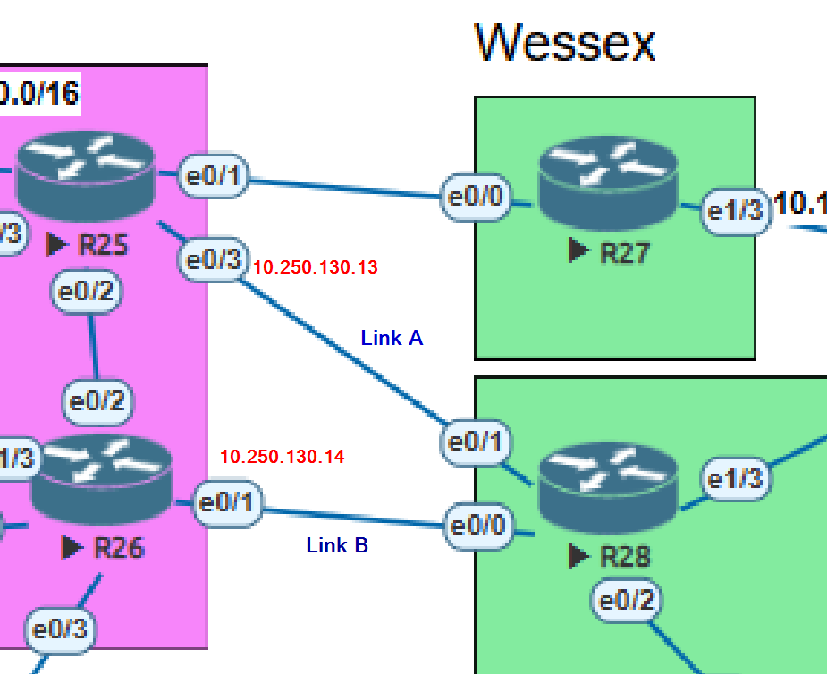
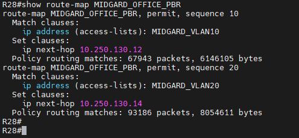
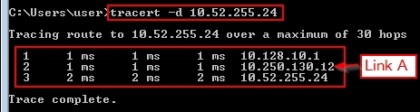
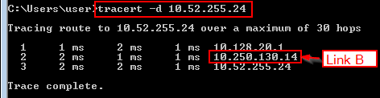
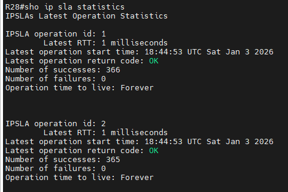
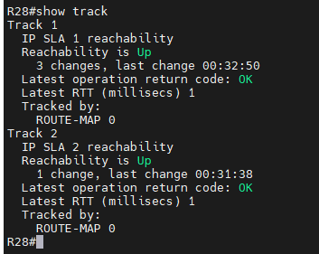

# Лабораторная работа - Политика маршрутизации в офисе Midgard

## Содержание:

1.  [Настроика политики маршрутизации для сетей офиса](#item_01)
2.  [Распределени трафика между двумя линками с провайдером](#item_02)
3.  [Настроика отслеживания линка через технологию IP SLA.(только для IPv4)](#item_03)
4.  [Настроика маршрута по-умолчанию для офиса Midgard.](#item_04)
5.  [План работы и изменения зафиксированы в документации](#item_05)

<a name="item_01"><h2>1. Настроите политику маршрутизации для сетей офиса (PBR)</h2></a>

### В чем же смысл PBR?

Обычно маршрутизатор решает, куда отправлять трафик, **только на основе адреса назначения**.  
Нам же важнот, что мы **переопределим это поведение** и зададим правило:

> «Трафик из этой офисной сети должен использовать именно один канал, а другого оффиса другой канал провайдера».

Это и есть **Policy-Based Routing (PBR)** — маршрутизация на основе политики.

---

### Зачем это нужно в Midgard

В зоне Midgard есть:

- **Офисные VLAN’ы:**
  - VLAN 10 → пользователи
  - VLAN 20 → пользователи
- **Два аплинка к провайдеру:**
  - Линия A
  - Линия B

**Без PBR:**
- Весь трафик использует **один маршрут по умолчанию**

**С PBR:**
- Можно **управлять потоком трафика для каждого VLAN отдельно**

---

### Техническая концепция (что настраивается)

PBR состоит из трёх основных элементов:

- **ACL** — определяет, какой трафик мы распознаём  
- **Route-map** — описывает политику (что делать с этим трафиком)  
- **Политика на интерфейсе** — применяет PBR к входящему трафику  

---

### Пример логики

| Сеть   | Политика              |
|-------|-----------------------|
| VLAN 10 | Линия провайдера A |
| VLAN 20 | Линия провайдера B |

В этом и есть суть **политики маршрутизации**.

---

### Важно

- PBR применяется **на входе (inbound)** на VLAN-интерфейсах маршрутизатора **R28**
- PBR **проверяется до таблицы маршрутизации**

Таким образом мы сделаем следующее:

### 1. Определим политику
  - VLAN 10 - проходит через линк А
  - VLAN 20 - проходит через линк B



<a name="item_02"><h2>2. Распределение трафика между двумя линками с провайдером</h2></a>

### 2. Применение этой политики на R28 испоьзуя:
  - АСL для определения VLAN траффика
  - route-map для определения next-hop для VLAN
  - использование этого route-map на входящем интерфейсе соответствующего VLAN

Конфигурация на R28

### A. Классификация оффисного траффика (ACL)
```
ip access-list extended MIDGARD_VLAN10
 permit ip 10.128.10.0 0.0.0.255 any

ip access-list extended MIDGARD_VLAN20
 permit ip 10.128.20.0 0.0.0.255 any
```
### B. Определение политика (route-map)
```
route-map MIDGARD_OFFICE_PBR permit 10
 match ip address MIDGARD_VLAN10
 set ip next-hop 10.250.130.12

route-map MIDGARD_OFFICE_PBR permit 20
 match ip address MIDGARD_VLAN20
 set ip next-hop 10.250.130.14
```
### C. Применение политики на интерфейсах каждого из VLAN

```
interface Ethernet0/2.10
 ip policy route-map MIDGARD_PBR

interface Ethernet0/2.20
 ip policy route-map MIDGARD_PBR
```


**Ping** мы делаем для теста на **loopback** интерфейс **R24 (10.52.255.24)** на обоих хостах:


Тут важно учитывать, что для работы PBR, этой конфигурации достаточно. И мы можем это верифицировать посредтвом такой комманды:

```
show route-map MIDGARD_OFFICE_PBR

```
Мы видим, что счетчик работает каждый раз, когда мы делаем пинг на наших хостах в **vlan 10** и **vlan 20** 



Но как мы уже увидили выше, наш ping не проходит. В чем же дело?

А дело в том, что на обоих маршрутизаторах R25 и R26 не настроены обратные марштруты, укажывоющие на наши vlan 10 и 20 соответственно.

Мы настроим эти маршруты на обоих маршрутизаторах и посмотрим что мы получим.

На R25 мы укажем маршрут в сторону **vlan 20 (10.128.10.0/24)**, с **next-hop** адресом **R28 e0/1 - 10.250.130.13**

```
ip route 10.128.10.0 255.255.255.0 10.250.130.13
```

На R2 мы укажем маршрут в сторону **vlan 20 (10.128.20.0/24)**, с **next-hop** адресом **R28 e0/0 - 20.250.130.15**

И если мы сделаем сейчас ping на loopback на R24, то получим 


Теперь проверим через какие линки проходит траффик с наших хостов, находящихся в vlan 10 и vlan 20. 

Выполним комманду tracert c VPC30 (vlan10)

```
tracert -d 10.52.255.24
```



Выполним комманду ту же комманду tracert теперь c VPC31 (vlan20)

```
tracert -d 10.52.255.24
```




<a name="item_03"><h2>3. Настроика Link Monitoring через технологию IP SLA.(только для IPv4)</h2></a>

### Мониторинг каналов связи (IPv4)

### 3.1 Назначение IP SLA

**Policy-Based Routing (PBR)** позволяет управлять направлением трафика, но **сам по себе не отслеживает отказ каналов**.  
Если провайдерский линк станет недоступным, PBR продолжит отправлять трафик в “чёрную дыру”.

Для решения этой проблемы используется **IP SLA (Service Level Agreement)**.

**IP SLA** — это встроенный в маршрутизаторы Cisco механизм активного мониторинга, который:
- отправляет тестовые пакеты (в нашем случае **ICMP**)
- проверяет доступность удалённого узла
- предоставляет результат в виде состояния **UP / DOWN**

---

### 3.2 Принцип работы IP SLA (простыми словами)

1. Маршрутизатор **R28** регулярно отправляет **ICMP** Echo-запросы
2. Адрес назначения — **loopback** адрес на 
3. Если ответы приходят — канал считается **доступным**
4. Если ответы не приходят — канал считается **недоступным**

IP SLA **не меняет маршруты напрямую**, а лишь измеряет состояние соединения.

---

### 3.3 Конфигурация IP SLA на R28

Для каждого провайдерского канала настраивается отдельная **IP SLA**-операция.

#### IP SLA для канала к провайдеру A (R25)

```
ip sla 1
 icmp-echo 10.250.130.12
 frequency 5
```

#### IP SLA для канала к провайдеру B (R26)

```
ip sla 2
 icmp-echo 10.250.130.14
 frequency 5
```

**Пояснение:**

- icmp-echo — тип проверки (ping)
- frequency 5 — интервал проверки (каждые 5 секунд)


### 3.4 Планирование IP SLA операций

Для запуска IP SLA операций используется планировщик:

```
ip sla schedule 1 life forever start-time now
ip sla schedule 2 life forever start-time now
```

Это обеспечивает **непрерывный мониторинг** каналов.

### 3.5 Tracking – связь IP SLA и PBR

Результаты IP SLA необходимо преобразовать в логическое состояние, которое можно использовать в PBR.
Для этого применяется механизм **Tracking**.

**Конфигурация tracking-объектов**

```
track 1 ip sla 1 reachability
track 2 ip sla 2 reachability
```
**Пояснение:**

- track 1 соответствует каналу провайдера A
- track 2 соответствует каналу провайдера B
- Состояние UP означает доступность канала
- Состояние DOWN означает отказ канала

### 3.6 Использование IP SLA в PBR (логика отказоустойчивости)

Tracking-объекты используются в PBR с ключевым словом ```verify-availability```.

```
route-map MIDGARD_OFFICE_PBR permit 10
 match ip address MIDGARD_VLAN10
 set ip next-hop verify-availability 10.250.130.12 1 track 1

route-map MIDGARD_OFFICE_PBR permit 20
 match ip address MIDGARD_VLAN20
 set ip next-hop verify-availability 10.250.130.14 1 track 2
```

Принцип работы:

- Пока tracking-объект находится в состоянии **UP**, **PBR** использует заданный **next-hop**
- Если **tracking**-объект переходит в состояние **DOWN**, соответствующее правило **PBR** игнорируется
- Трафик автоматически обрабатывается обычной таблицей маршрутизации (**default route**)

Таким образом достигается **автоматическое переключение при отказе канала**.

### 3.7 Проверка состояния IP SLA

Для контроля работы IP SLA и tracking используются команды:
```
show ip sla statistics
show track
```
**show ip sla statistics** output:



**show track** output:



Эти команды позволяют:

- увидеть успешные и неуспешные проверки
- определить текущее состояние каналов
- подтвердить корректную работу механизма мониторинга


<a name="item_04"><h2>4. Настроика маршрута по-умолчанию для офиса Midgard.</h2></a>

Поведение отказоустойчивости VLAN-трафика на R28
------------------------------------------------

### Policy-Based Routing (PBR) vs отказоустойчивость через таблицу маршрутизации

* * * * *

Обзор
-----

В этом разделе объясняется, **как происходит отказоустойчивость VLAN-трафика на R28 при отказе основного uplink-канала**, а также **почему поведение отличается в зависимости от дизайна PBR**.

Сравниваются два сценария:

-   **Сценарий A --- Best Practice PBR (явный fallback внутри PBR)**

-   **Сценарий B --- Текущая конфигурация (fallback через таблицу маршрутизации)**

Понимание этого различия критически важно для **предсказуемой и детерминированной отказоустойчивости**.

* * * * *

Контекст сети (R28)
-------------------

-   **VLAN 10**: `10.128.10.0/24`

-   **Основной uplink**: R25 (`10.250.130.12`, отслеживается через `track 1`)

-   **Резервный uplink**: R26 (`10.250.130.14`, отслеживается через `track 2`)

-   **PBR применяется** на сабинтерфейсах:

    -   `Ethernet0/2.10`

    -   `Ethernet0/2.20`

* * * * *

Сценарий A --- Best Practice PBR (рекомендуется)
----------------------------------------------

### Описание

В этом дизайне **для каждого VLAN в route-map явно определены основной и резервный next-hop** с использованием `verify-availability`.

Отказоустойчивость происходит **непосредственно внутри PBR**, без зависимости от глобальной таблицы маршрутизации.

* * * * *

### Пример (VLAN 10)
```
route-map MIDGARD_OFFICE_PBR permit 10
 match ip address MIDGARD_VLAN10
 set ip next-hop verify-availability 10.250.130.12 1 track 1
 set ip next-hop verify-availability 10.250.130.14 2 track 2
```

| Условие | Результат |
| --- | --- |
| R25 доступен | VLAN 10 → R25 |
| R25 недоступен, R26 доступен | VLAN 10 → R26 |
| Оба недоступны | PBR не применяется → используется таблица маршрутизации |

* * * * *

### Почему это Best Practice

-   Логика отказоустойчивости **явная и задана для каждого VLAN**

-   Нет зависимости от поведения default-маршрута

-   Проще **объяснять и диагностировать**

-   Поведение остаётся **стабильным**, даже если default-маршруты меняются

* * * * *

Сценарий B --- Текущая конфигурация (fallback через таблицу маршрутизации)
------------------------------------------------------------------------

### Описание

В текущей конфигурации для VLAN 10 определён **только один PBR next-hop**.
```
route-map MIDGARD_OFFICE_PBR permit 10
 match ip address MIDGARD_VLAN10
 set ip next-hop verify-availability 10.250.130.12 1 track 1
```

Если этот next-hop становится недоступным, **PBR не может выбрать альтернативу**.

* * * * *

### Что происходит при отказе R25?

1.  IP SLA до `10.250.130.12` перестаёт отвечать

2.  `track 1` переходит в состояние **DOWN**

3.  PBR не может установить next-hop для VLAN 10

4.  IOS переключается на **обычную маршрутизацию**

* * * * *

### Default-маршруты на R28
```
ip route 0.0.0.0 0.0.0.0 10.250.130.12 track 1
ip route 0.0.0.0 0.0.0.0 10.250.130.14 200
```

-   Основной default-маршрут (через R25) **удаляется**, когда `track 1` в состоянии DOWN

-   Активируется плавающий статический маршрут (AD 200) через **R26**

| Условие | Используемый путь |
| --- | --- |
| R25 доступен | VLAN 10 → R25 (через PBR) |
| R25 недоступен | VLAN 10 → R26 (через default-маршрут) |

✅ Отказоустойчивость **работает**,\
⚠️ но происходит **косвенно**, через таблицу маршрутизации, а не напрямую через PBR.

* * * * *

Сравнение дизайнов
------------------

| Параметр | Сценарий A --- Best Practice | Сценарий B --- Текущий |
| --- | --- | --- |
| Где происходит failover | Внутри PBR | Таблица маршрутизации |
| Детерминированность | Высокая | Средняя |
| Зависимость от default route | Нет | Да |
| Удобство диагностики | Чёткое | Менее очевидное |
| Рекомендовано для продакшена | ✅ Да | ⚠️ Допустимо, но не идеально |

* * * * *

Если хочешь, в следующем шаге могу:

-   упростить текст под **отчёт для преподавателя / экзамена**
-   сделать **короткую версию (executive summary)**
-   или помочь оформить это как **официальную lab-документацию**