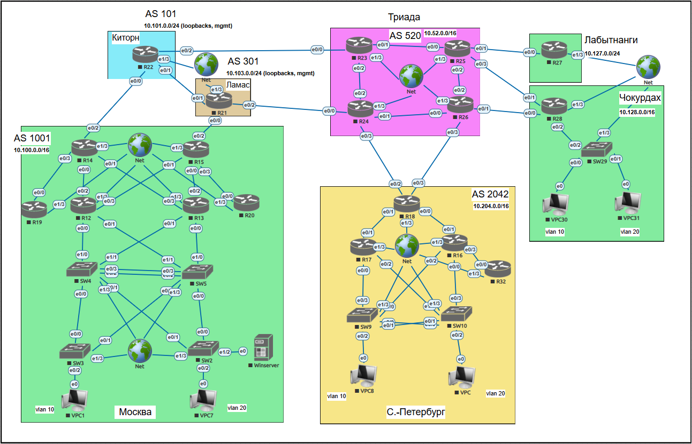
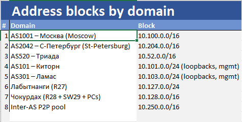
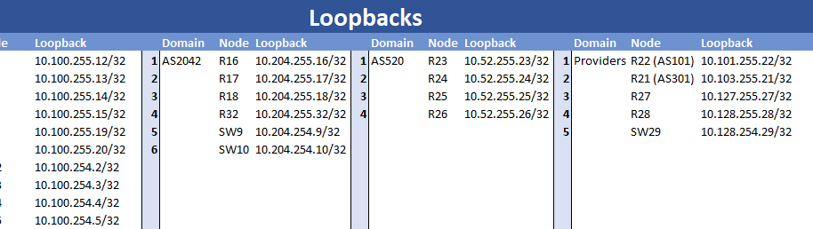
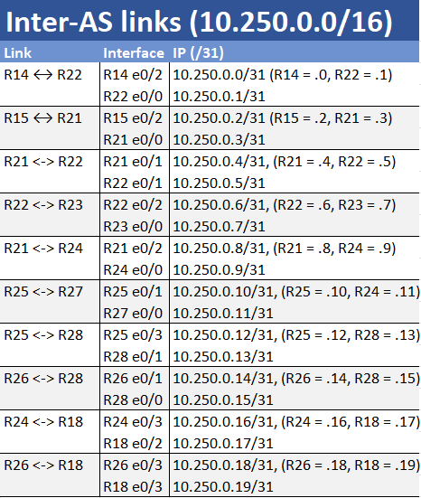

# Лабораторная работа - Архитектура Сети

## Содержание:

- [Топология](#item_01)
- [Конвенции](#item_01.1)
- [Таблица адресации](#item_02)
- [Цели](#item_03)
- [Контекст / Сценарий](#item_04)
- [Часть 1: Разработка и документация адресного пространства для лаборатории.](#part_1)
- [Часть 2: Настроите ip адреса на каждом активном порту](#part_2)
- [Часть 3: Настроите каждый VPC в каждом офисе в своем VLAN.](#part_3)
- [Часть 4: Настроите VLAN/Loopbackup interface управления для сетевых устройств](#part_4)
- [Часть 5: Настроите сети офисов так, чтобы не возникало broadcast штормов, а использование линков было максимально оптимизировано](#part_5)
- [Часть 6: Используете IPv4. IPv6 по желанию](#part_6)

<a name="item_01"><h2>Топология</h2></a>

<a name="item_01.1"><h2>Конвенции</h2></a>

<a name="item_01"><h2>Таблица Адресации</h2></a>

Тут я хотел бы обозначить несколько моментов. Во-первых, необходимо определиться с конвенциями. Ниже я описываю, какие именно конвенции я использую.

 ### Глобальные правила

**P2P**-линки используют **/31** (RFC 3021). Если устройство не поддерживает **/31**, используйте следующий **/30** из того же пула.

**Loopback-адреса** — /32 (ID роутеров).

**Кампусные VLAN** — /24.

Каждому автономному домену **(AS)** выделяется свой **/16**, разделённый на предсказуемые роли:

**…120.0/24** = ядро / P2P с провайдерами

**…130.0/24** = распределительный слой ↔︎ access P2P

**…10.0/16 и …20.0/16** = VLAN 10 и 20 для пользователей

**…254.x/32** = loopback-адреса коммутаторов (необязательно)

**…255.x/32** = loopback-адреса маршрутизаторов

Все меж-AS соединения используют отдельный глобальный пул 10.250.0.0/16 (его легко увидеть в traceroute).

### Ниже приведены блоки адресов для каждой зоны

### Loopback адреса для всех устройств. Первые два октета соответствуют зонам, третий актет - для маршрутизаторов = .255, для коммутаторов = .254

### Inter-AS линки (10.250.0.0/16)

