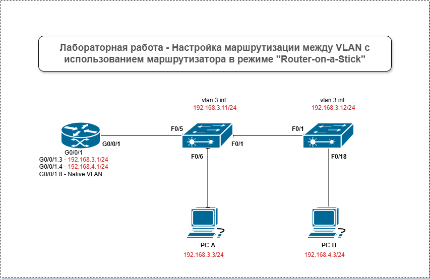

# Лабораторная работа - Настройка маршрутизации между VLAN с использованием маршрутизатора в режиме "Router-on-a-Stick"

### Задание:

 1. Построить Сеть и настроить сетевые устройства
 2. Создание VLAN и назначение портов коммутатора
 3. Настройка магистрального канала 802.1Q между коммутаторами
 4. Настройка маршрутизации между VLAN на маршрутизаторе
 5. Проверка работы маршрутизации между VLAN

### Решение:

В первой части необходимо соеденить выбрать опеределенные устройства и соеденить их между собой.

### Топология Сети

### Схема IP адресов

### Таблица Подсетей

### Предустановки

Современные коммутаторы используют VLAN (виртуальные локальные сети) для сегментации сети, чем раньше занимались роутеры. VLAN решают задачи масштабируемости, безопасности и упрощают управление сетью. В итоге VLAN упрощают проектирование сети под нужды организации. Чтобы VLAN могли «общаться» друг с другом, нужно устройство, работающее на 3-м уровне OSI, обычно это роутер — он добавляет безопасность и улучшает управление трафиком.

Транки VLAN полезны для расширения VLAN на несколько устройств, позволяя трафику разных VLAN проходить по одной линии связи, сохраняя идентификаторы и сегментацию. Популярный способ маршрутизации между VLAN, «Router-On-A-Stick», использует транк между роутером и коммутатором, позволяя всем VLAN передавать данные через роутер.

В этом лабе я создам VLAN на обоих коммутаторах, назначу VLAN на порты, проверю их работу, настрою транки между коммутаторами и между S1 и R1, а также меж-VLAN маршрутизацию на R1, чтобы устройства в разных VLAN могли общаться, независимо от их подсети.