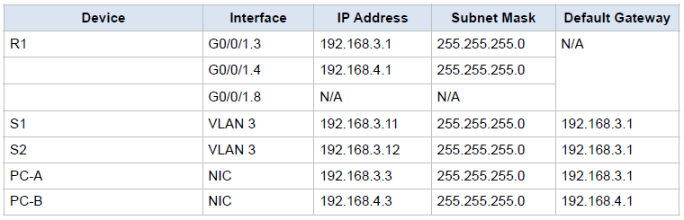

# Лабораторная работа - Настройка маршрутизации между VLAN с использованием маршрутизатора в режиме "Router-on-a-Stick"

### Задание:

 1. Построить Сеть и настроить сетевые устройства
 2. Создание VLAN и назначение портов коммутатора
 3. Настройка магистрального канала 802.1Q между коммутаторами
 4. Настройка маршрутизации между VLAN на маршрутизаторе
 5. Проверка работы маршрутизации между VLAN

### Предустановки

Современные коммутаторы используют VLAN (виртуальные локальные сети) для сегментации сети, чем раньше занимались роутеры. VLAN решают задачи масштабируемости, безопасности и упрощают управление сетью. В итоге VLAN упрощают проектирование сети под нужды организации. Чтобы VLAN могли «общаться» друг с другом, нужно устройство, работающее на 3-м уровне OSI, обычно это роутер — он добавляет безопасность и улучшает управление трафиком.

Транки VLAN полезны для расширения VLAN на несколько устройств, позволяя трафику разных VLAN проходить по одной линии связи, сохраняя идентификаторы и сегментацию. Популярный способ маршрутизации между VLAN, «Router-On-A-Stick», использует транк между роутером и коммутатором, позволяя всем VLAN передавать данные через роутер.

В этом лабе я создам VLAN на обоих коммутаторах, назначу VLAN на порты, проверю их работу, настрою транки между коммутаторами и между S1 и R1, а также меж-VLAN маршрутизацию на R1, чтобы устройства в разных VLAN могли общаться, независимо от их подсети.

### Решение:

В первой части необходимо соеденить выбрать опеределенные устройства и соеденить их между собой.

### Топология Сети

### Схема IP адресов

### Таблица Подсетей

## 1. Настройте базовые параметры маршрутизатора. Откройте окно конфигурации.

Ниже приведенные комманды могут быть использованы для настроека как для маршрутизаторов, так и коммутаторов.

#### 1. Подключитесь к маршрутизатору ( коммутатору) через консоль и перейдите в привилегированный режим EXEC. 

        enable

#### 2. Перейдите в режим конфигурации. 

        config terminal 

#### 3. Присвойте маршрутизатору имя устройства. 

        hostname R1

#### 4. Отключите поиск DNS, чтобы предотвратить попытки маршрутизатора переводить неправильно введенные команды как имена хостов. 

        no ip domain-lookup

#### 5. Назначьте «class» в качестве зашифрованного пароля привилегированного EXEC. 

        enable secret class

#### 6. Назначьте «cisco» в качестве пароля для консоли и включите вход. 

    line con 0            
     password cisco        
     login
     exit

#### 7. Назначьте «cisco» в качестве пароля для VTY и включите вход. 

    line vty 0 15
     password cisco
     login
     exit

#### 8. Зашифруйте пароли в открытом виде. 

        service password-encryption

#### 9. Создайте баннер, предупреждающий всех, кто получает доступ к устройству, что несанкционированный доступ запрещен. 

#### 10. Сохраните текущую конфигурацию в файл конфигурации запуска. 

        copy running-config startup-config

#### 11. Установите время на маршрутизаторе.

        clock set 14:30:00 3 Nov 2024 

## 2. Создаем Подсети и отводим порты к ним.

### 1. Создаем вначале Виртуальные локальные сети на обоих коммутаторах

#### a. Создаем Виртуальные сети и даем им соответствующие имена в соответствии со схемой в вышеприведенной таблице
  
      vlan 3
       name Management
      vlan 4
       name Operations
      vlan 7
       name ParkingLot
      vlan 8
       name Native

#### b. На этом этапе мы будем конфигурировать менеждмент интерфейс и шлюз по умолчению на каждом из коммутаторов S1 и S2 используя IP адреса из таблицы .

##### Конфигурация менеджмент интерфейса на коммутаторе S1

     interface vlan 3
      ip address 192.168.3.11 255.255.255.0

##### Конфигураци шлюза по умолчению на коммутаторе S1

     ip default-gateway 192.168.3.1

##### Конфигурация менеджмент интерфейса на коммутаторе S2

     interface vlan 3
      ip address 192.168.3.12 255.255.255.0

##### Конфигураци шлюза по умолчению на коммутаторе S2

     ip default-gateway 192.168.3.1

#### c. Назначьте все неиспользуемые порты на обоих коммутаторах в VLAN ParkingLot, настройте их для статического режима доступа и административно деактивируйте их.

###### на S1

     interface range f0/2-4,f0/7-24,g0/1-2
      switchport mode access
      switchport access vlan 7
      shutdown

###### на S2

     interface range f0/2-17,f0/19-24,g0/1-2
      switchport mode access
      switchport access vlan 7
      shutdonw

### 2. Назначьте VLAN-ы правильным интерфейсам коммутаторов.

###### на S1

        intface f0/6
          switchport mode access
          switchport access vlan 3

###### на S2

        intface f0/18
          switchport mode access
          switchport access vlan 3

#### Выполните команду show vlan brief и убедитесь, что VLAN-ы назначены правильным интерфейсам.
 
##### на S1

   

##### на S2

 

## 3. Настройте магистраль 802.1Q (Trunk) между коммутаторами.

### 1. Тут мы вручную настроим магистральный интерфейс F0/1.

#### а. Здесь необходимо изменить режим порта коммутатора на интерфейсе F0/1, чтобы принудительно включить магистральный режим (Trunk). 

##### на S1
        interface f0/1
         switchport mode trunk

#### Настроим Trunk таким образом, чтобы native VLAN был на 8.

         switchport trunk native vlan 8

#### На Trunk-е необходимо разрешить VLAN-ы 3,4 и 8

         switchport trunk allowed vlan 3,4,8

#### Насторим Trunk на коммутаторе S2

         interface f0/1
          switchport mode trunk

#### Проверим конфигурацию на S2

Как видно из вывода комманды, мы видим, что Trunk заработал на порте f0/1.

На данный момент у нас настроены Trunk-и между обоими коммутаторами.

#### Сейчас можно настроить Trunk на порте F0/5 на коммутаторе S1

         interface f0/5
          switchport mode trunk

#### Сохраним настройки 

         copy running-config startup-config

#### Проверим сделанные настройки

         show interface trunk

 

Заметьте, что мы отконфигурировали два интерфейса F01/ и F0/5, но в выводе нашей комманды мы видим только интерфейс F0/1. Дело в том, что комманда show interface trunk показывает тот интерфейс, на которые стоит рабочий trunk, то есть оба конца магистрали настроины и находятся в рабочем состояни. А так как магистраль идущая на маршрутизатор настроена только со стороны коммутатора, то это и является причиной.

##### на S1
        interface f0/5
         switchport mode trunk

#### Теперь еще раз выполним комманду show interface trunk

Обратите внимание, что теперь в выводе команды мы можем увидеть F0/5.

## 4. На данном этапе будем настраивать маршрутизацию между VLAN-ми (Inter-VLAN Routing) на маршрутизаторе.

#### Активируем порт  g0/0/1

         interface g0/0/1
          no shutdown

#### Настроим субинтерфейсы для каждого VLAN в соответствии с таблицей IP-адресов. Дадим также описание к ним. Все субинтерфейсы используют инкапсуляцию 802.1Q. Присвоим также IP адреса в соответствии с таблицей

         interface g0/0/1.3
          description VLAN3-Management
          encapsulation dot1q 3
          ip address 192.168.3.1 255.255.255.0

         interface g0/0/1.4
          description VLAN4-Operations
          encapsulation dot1q 4
          ip address 192.168.4.1 255.255.255.0

#### Мы создадим субинтерфейс для VLAN 8 но не будем назначать ему IP адрес

         interface g0/0/1.8
          description VLAN8-Native
          encapsulation dot1q 8 native

#### Проверим конфигурацию созданных субинтерфейсов

         show run 

#### Все три субпорта отконфигурированы теперь мы будем проверять можем ли мы делать пинги.